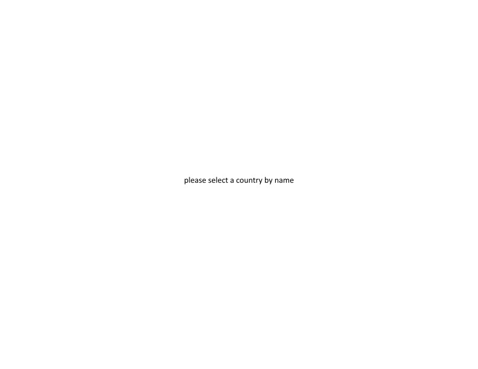



{{ country | replace: " ", "&nbsp;" }}
[{{ country_text }}](#0){:onClick="return setPlotSrc('plots/svg/{{ country }}.svg');"}



{{ everything | array_to_sentence_string | replace: ", ", ",&nbsp;&nbsp; " | replace: " and ", " and&nbsp;&nbsp; " }}

## What do these plots show?

Lorem ipsum dolor sit amet, consectetur adipiscing elit, sed do eiusmod tempor incididunt ut labore et dolore magna aliqua. Ut enim ad minim veniam, quis nostrud exercitation ullamco laboris nisi ut aliquip ex ea commodo consequat. Duis aute irure dolor in reprehenderit in voluptate velit esse cillum dolore eu fugiat nulla pariatur. Excepteur sint occaecat cupidatat non proident, sunt in culpa qui officia deserunt mollit anim id est laborum.

## Why should I care?

Lorem ipsum dolor sit amet, consectetur adipiscing elit, sed do eiusmod tempor incididunt ut labore et dolore magna aliqua. Ut enim ad minim veniam, quis nostrud exercitation ullamco laboris nisi ut aliquip ex ea commodo consequat. Duis aute irure dolor in reprehenderit in voluptate velit esse cillum dolore eu fugiat nulla pariatur. Excepteur sint occaecat cupidatat non proident, sunt in culpa qui officia deserunt mollit anim id est laborum.

## A few more details

Lorem ipsum dolor sit amet, consectetur adipiscing elit, sed do eiusmod tempor incididunt ut labore et dolore magna aliqua. Ut enim ad minim veniam, quis nostrud exercitation ullamco laboris nisi ut aliquip ex ea commodo consequat. Duis aute irure dolor in reprehenderit in voluptate velit esse cillum dolore eu fugiat nulla pariatur. Excepteur sint occaecat cupidatat non proident, sunt in culpa qui officia deserunt mollit anim id est laborum.

## Acknowledgements

Special thanks to [Johns Hopkins University](https://www.jhu.edu/) and the [ESRI Living Atlas Team](https://livingatlas.arcgis.com/en/) for providing the world with such a valuable resource. Like almost every analysis online, this work was based on the [JHU CSSE Data](https://github.com/CSSEGISandData/COVID-19).
Also, thanks and kudos to [GitHub](https://github.com/) for supporting Open Source software and research!

[{: style="vertical-align: middle;"}](https://creativecommons.org/licenses/by/4.0/) This work is licensed under a [Creative Commons Attribution 4.0 International License](https://creativecommons.org/licenses/by/4.0/).

This site is generated from [{{ site.github.repository_url }}]({{ site.github.repository_url }}) by automated [actions](https://github.com/adfernandes/covid19/actions?query=workflow%3A%22Build%20%26%20Deploy%22).

Copyright&nbsp;&copy;&nbsp;{{ 'now' | date: "%Y" }} by $${\sfst Andrew\ Fernandes\ \langle\email{andrew}{\scriptsize @}{fernandes.org}\rangle}$$.
